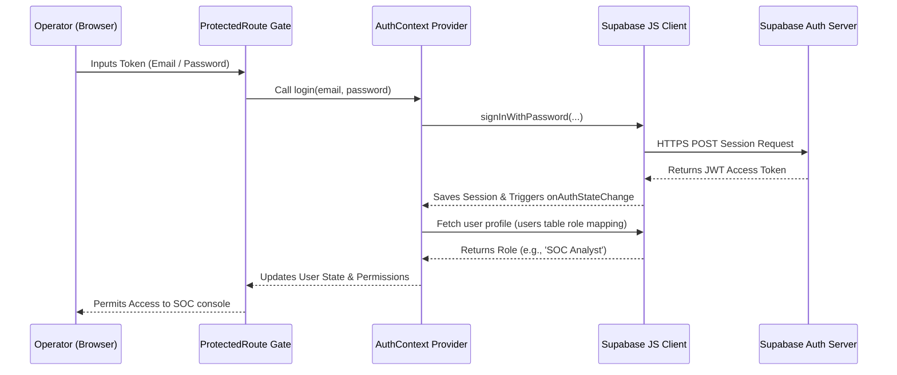
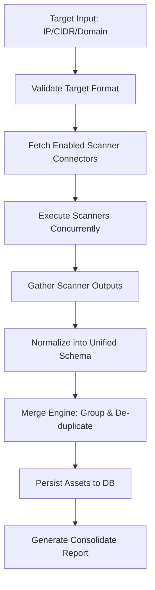

# ThreatStream Security Operations Platform Architecture

> This document describes the intended platform shape and the code that is currently present in the repository. Some sections are aspirational and should be treated as roadmap language rather than fully verified runtime behavior.

This document describes the design patterns, layer organization, and modular code architecture implemented in the ThreatStream Security Operations Center (SOC) platform.

---

## 1. Directory Structure Organization

The codebase is organized to support scalability, strong modular boundaries, and direct transition to live backend services:

```
threatstream/
├── .env.local                <-- Local secrets (Supabase credentials)
├── .env.example              <-- Template for deployment environments
├── DEPLOYMENT.md             <-- Guide on launching self-hosted containers
├── ARCHITECTURE.md           <-- [This File] Architectural specs
├── DATABASE.md               <-- Schema definition for all 36 database tables
├── MIGRATION_GUIDE.md        <-- Setup guide for Supabase / PostgreSQL schema
├── package.json
├── index.html
├── src/
│   ├── main.jsx              <-- App mount point
│   ├── App.jsx               <-- Handles router page registrations
│   ├── index.css             <-- Global design system CSS tokens
│   ├── config/
│   │   └── env.js            <-- Centralized fail-fast environment validation
│   ├── lib/
│   │   └── supabase/
│   │       └── client.js     <-- Reusable Supabase client wrapper
│   ├── types/
│   │   └── index.js          <-- Unified data schemas & JSDoc types catalog
│   ├── layouts/
│   │   └── DashboardLayout.jsx <-- Reusable page template frame
│   ├── components/           <-- Reusable component library (DataTable, MetricCard...)
│   ├── repositories/         <-- Repository Layer: Directly queries Supabase/fallback
│   │   ├── ThreatRepository.js
│   │   ├── AssetRepository.js
│   │   ├── TelemetryRepository.js
│   │   ├── IncidentRepository.js
│   │   ├── UserRepository.js
│   │   └── ConfigurationRepository.js
│   ├── services/             <-- Service Layer: Coordinates repositories & business stubs
│   │   ├── ThreatService.js
│   │   ├── AssetService.js
│   │   ├── TelemetryService.js
│   │   ├── IncidentService.js
│   │   ├── UserService.js
│   │   └── ConfigurationService.js
│   └── pages/                <-- UI Views: Communicates only with Services
│       ├── Dashboard.jsx
│       ├── ThreatIntelligence.jsx
│       ├── Assets.jsx
│       └── ...
└── supabase/
    └── migrations/           <-- PostgreSQL schema init files
        └── 20260705000000_init_soc_schema.sql
```

---

## 2. Decoupled Multi-Tier Design Pattern

To prevent duplicate code and ensure a clean path to full database integration, we follow a strict **Three-Tier Architecture**:

```
[  UI Page Views  ]
        │   (Communicates exclusively with Services via async requests)
        ▼
[  Service Layer  ]   <-- e.g. ThreatService.js, AssetService.js
        │   (Manages business logic, coordinates scanners, logs reports)
        ▼
[ Repository Layer ]  <-- e.g. ThreatRepository.js, AssetRepository.js
        │   (Direct database access wrappers, maps rows to types, mock fallback)
        ▼
[ Supabase Client ]   <-- lib/supabase/client.js
        │   (Pre-configured with fail-fast env variables)
        ▼
[ PostgreSQL DB  ]
```

### A. Centralized Type/Model Catalog
All records retrieved from repositories are mapped to models defined in `src/types/index.js` (such as `Threat`, `IOC`, `Asset`, `Incident`, etc.). This enforces structural schema validation across the client bundle.

### B. Fail-Fast Environment Validation
The configuration file `src/config/env.js` executes immediately on app load. If the required keys (`VITE_SUPABASE_URL` and `VITE_SUPABASE_PUBLISHABLE_KEY`) are missing, it throws a critical runtime error, preventing half-configured setups from starting.

### C. Graceful Mock Adapter Fallback
Each repository contains a local query wrapper. If the Supabase client encounters a missing table or fails to connect, it falls back to the in-memory mock datasets. This preserves frontend functionality out-of-the-box for demonstration and offline development.

---

## 3. Future Extension Strategy

1. **Integrating Live DB Data**:
   - Enable the schema tables inside Supabase (using `MIGRATION_GUIDE.md`).
   - Populate the database.
   - Set `VITE_USE_MOCK=false` inside the local `.env.local`.
2. **Plugging in Scanning Integrations**:
   - Add scan runners inside `src/services/AssetService.js` (e.g. mapping `executeScan` to a remote FastAPI endpoint running Nmap).
3. **Plugging in Threat Feeds**:
   - Add new feed collectors in the backend which write raw values directly to the `iocs` and `threat_events` tables in PostgreSQL.

---

## 4. Authentication Flow

The authentication architecture is built on Supabase Auth (JWT tokens) and loaded via React context provider:



---

## 5. RBAC Permission Model

Granular access controls are enforced on all module views using route permissions mapping:

| Role | Mapped Permissions | Protected Views |
| :--- | :--- | :--- |
| **Administrator** | All read/write controls, user profiles, configuration thresholds | `/administration`, `/dashboard`, `/assets`, `/incidents` |
| **SOC Analyst** | Read intel/assets/telemetry/incidents, write YARA/Sigma rules | `/dashboard`, `/threat-intelligence`, `/assets`, `/endpoints` |
| **Incident Responder** | Read logs, write and mitigate incidents, close tickets | `/dashboard`, `/incidents`, `/malware-analysis` |
| **Threat Hunter** | Read logs, scan assets directory, write rules | `/dashboard`, `/assets`, `/threat-hunting` |
| **Read Only** | Read-only access to threat maps, directories, and telemetries | `/dashboard`, `/threat-intelligence`, `/assets` |

---

## 6. Realtime Subscription Architecture

Real-time notifications and Attack Globe arcs synchronization are powered by PostgreSQL Write-Ahead Log (WAL) replication streams routed via Supabase Realtime pub/sub socket channels:

```
[ PostgreSQL Database Mutation ] (e.g. INSERT threat_events)
               │
               ▼
[ Write-Ahead Log (WAL) ]
               │ (Supabase Realtime listens to replication logs)
               ▼
[ Supabase Realtime Engine ]
               │ (Filters updates according to channel scope)
               ▼
[ WebSockets Stream Room ]
               │
               ▼
[ ThreatRepository client listener ]
               │ (Executes callbacks on child insertion)
               ▼
[ ThreatService & React Globe State ] (Attack arc render animation)
```

---

## 7. Threat Intelligence Platform (TIP) Module Architecture

The Threat Intelligence Platform is built on top of our 3-tier architecture to support exploration, analysis, and correlations:

```
[ UI Pages / ThreatIntelligence ] (Tabs: Dashboard, Explorer, Actors, Campaigns, Malware, Connectors)
               │
               ▼
[ Business Layer / ThreatService ] (Calculates metrics, manages enrichments, exports STIX 2.1)
               │
               ▼
[ Repository Layer / ThreatRepository ] (Queries PostgreSQL tables: threat_actors, campaigns, malware_families, iocs, correlations)
               │
               ▼
[ Database Layer / Supabase PostgreSQL ] (Enforces RLS policies and cascades)
```

* **Correlation Engine**: Correlates incoming honeypots data (destination targets, source IPs) with active campaigns, malware families, and attributed threat actors using the `ioc_correlations` mapping schema.
* **Plug-in Connector Framework**: Allows feed integrations to implement a common interface. Raw indicators collected by background daemons are written directly to `iocs` and mapped to `threat_actors` or `campaigns` to populate the dashboards dynamically.

---

## 8. Asset Intelligence & Attack Surface Management Architecture

The Asset Intelligence Platform is built on top of our 3-tier architecture to support exploration, analysis, and correlations:

```
[ UI Pages / Assets ] (Tabs: Dashboard, Directory, Discovery, Topology)
               │
               ▼
[ Business Layer / AssetService ] (Calculates metrics, runs Risk Engine calculations, exports CycloneDX SBOM)
               │
               ▼
[ Repository Layer / AssetRepository ] (Queries PostgreSQL tables: assets, services, software_inventory, asset_relationships)
               │
               ▼
[ Database Layer / Supabase PostgreSQL ] (Enforces RLS policies and cascades)
```

* **Asset Risk Engine (Weighted Matrix Engine)**: Dynamically evaluates the risk posture of every registered asset on fetch. The score is computed using criticality weights, port density metrics, internet-facing penalties, unpatched CVE vulnerability severity values, and active control credits (patches applied).
* **Pluggable Scanner Plugin Coordinator**: Coordinates CLI scans using standard executors. It coordinates Nmap, RustScan, Masscan, Nuclei, WhatWeb, SSLyze, testssl.sh, Nikto, OpenVAS, and Greenbone. Telemetry outputs are parsed and written directly to the database.

---

## 9. Endpoint Telemetry & Detection Engineering Architecture

The Telemetry and Detection Platform is built on top of our 3-tier architecture:

```
[ UI Pages / ThreatHunting ] (Tabs: Dashboard, Explorer, Rules, Connectors)
               │
               ▼
[ Business Layer / TelemetryService ] (Runs EventNormalizer, executes DetectionEngine matching, writes Alerts)
               │
               ▼
[ Repository Layer / TelemetryRepository ] (Queries PostgreSQL tables: telemetry, alerts, detections)
               │
               ▼
[ Database Layer / Supabase PostgreSQL ] (Enforces RLS policies and cascades)
```

* **Event Normalization Layer**: Maps heterogeneous logs (Sysmon, Windows Event Log, Linux Auditd, OSQuery snapshot, Zeek, Suricata, CrowdSec, Falco) to a unified event schema with standard PID, PPID, user, command line, severity, and correlation ID fields.
* **Detection Engine Matcher**: Runs Sigma YAML queries and YARA metadata filters against incoming telemetry payloads in real-time. Matches trigger automated alerts containing evidence details, correlation identifiers, and MITRE mapping context.
* **Alert & Timeline Engine**: Structures security alerts into chronological visual trees representing parent/child processes execution flow and logical threat actors attribution maps.

---

## 10. Incident Response & Case Management Architecture

The Incident Response and Forensics Platform is built on top of our 3-tier architecture:

```
[ UI Pages / Incidents ] (Tabs: Dashboard, Queue, Workspace)
               │
               ▼
[ Business Layer / IncidentService ] (Coordinates updates, processes Playbook checklists, compiles Markdown Reports)
               │
               ▼
[ Repository Layer / IncidentRepository ] (Queries PostgreSQL tables: incidents, incident_notes, incident_timeline_events)
               │
               ▼
[ Database Layer / Supabase PostgreSQL ] (Enforces RLS policies and cascades)
```

* **Timeline Reconstruction Engine**: Unifies SIEM logs, raw host event process executions, alerts, and custom notes into a timeline view.
* **Response Playbook Checklist**: Executes Containment, Eradication, and Recovery steps. Progress and checklist state modifications are propagated down to the persistence layer.
* **Forensic Evidence Cabinet**: Collects screenshots, memory dumps, PCAP flows, and registry exports. Includes cryptographic hash checks (SHA-256) and chain of custody logs.
* **Investigation Graph Generator**: Logical link engine mapping nodes (`[Incident Case]` -> `[Host Asset]` -> `[Malware Family]` -> `[Threat Actor Group]` -> `[Related IOC Domain]`).

---

## 8. Threat Analysis Platform

### 8.1 Malware Analysis Engine

Full static analysis workspace for every file type:

```
PE / ELF / Mach-O / APK / PDF / Office / Archive / Script
```

**Data Model** (`MalwareSampleModel`):
- Cryptographic: MD5, SHA1, SHA256, SSDeep, ImpHash
- Static: Sections, Imports, Exports, Strings, Resources
- PE-specific: TLS Callbacks, Digital Signature, Compile Time
- Classification: Entropy gauge, Architecture, Compiler, Packer
- Relationships: Threat Actor, Campaign, Incident, IOC, CVE

**Analysis Tabs**: Overview · Strings · Imports · Exports · Sections · Hashes · YARA · MITRE · Behavior

```
[ UI: MalwareAnalysis.jsx ] (Split panel: Sample Library + Analysis Workspace)
               │
               ▼
[ MalwareService ] (Static profiling, graph building, enrichment dispatch)
               │
               ▼
[ MalwareRepository ] (malware_samples, yara_rules, hunt_sessions tables)
               │
               ▼
[ Supabase PostgreSQL ] (threat_analysis migration)
```

### 8.2 YARA Rule Platform

Enterprise rule lifecycle management:

- **YARARule** model: name, author, version, category, severity, definition, MITRE mapping
- Rule categories: Ransomware, Credential Dumping, Lateral Movement, Persistence, C2, Exfiltration
- Execution counter + last triggered timestamp
- Rule versioning for audit purposes
- Future: live execution engine against telemetry stream

### 8.3 Threat Hunting Workspace

KQL-like investigation console:

- **HuntSession** model: query, query_type, analyst, status, result_count, bookmarks
- Query types: KQL · IOC · Process · Timeline · MITRE · Asset · Cross-platform
- Saved hunt library with bookmark management
- Recent searches tracking
- Result tabs: Events · Timeline · Process Tree · Assets · IOC Pivots

### 8.4 Enrichment Engine

Provider-agnostic IOC enrichment architecture:

| Provider | Type | IOC Support |
|---|---|---|
| VirusTotal | Threat Intel | hash, ip, domain, url |
| Hybrid Analysis | Sandbox | hash, url |
| Any.Run | Sandbox | hash, url |
| AbuseIPDB | Reputation | ip |
| GreyNoise | Noise Filter | ip |
| Shodan | Attack Surface | ip, domain |
| Censys | Asset Discovery | ip, domain |
| URLHaus | Malware URLs | url, domain, hash |
| OTX AlienVault | OSINT | ip, domain, hash, url |
| MISP | Threat Sharing | ip, domain, hash, url |
| OpenCTI | CTI Platform | ip, domain, hash, url |

Architecture: `EnrichmentService.enrichIOC()` fans out to all active, compatible providers and aggregates results.

### 8.5 Graph Investigation Engine

Universal entity relationship graph:

```
Asset ──> Incident ──> Alert ──> IOC ──> Threat Actor
  │                                          │
  └──> Vulnerability                         ▼
                                        Campaign ──> Malware ──> Hash
                                                         │
                                                         ▼
                                                  CVE ──> MITRE ──> Telemetry
```

**GraphNode** model: `{ id, label, type, risk_score, metadata }`

Node types: `asset` | `incident` | `alert` | `ioc` | `actor` | `campaign` | `malware` | `cve` | `mitre`

Future: Force-directed D3.js or Sigma.js visualization engine.

---

## 10. Operations Platform

The Operations Platform handles background jobs, integrations, audits, backups, system load telemetry, and security settings.

### 10.1 Background Job Queue

Handles scan runs, collection ingestion, backup creation, feed collection, report compiles:
- `jobs` table (status: `queued` | `running` | `completed` | `failed` | `cancelled`)
- Tracks priority levels (1-10) and completion progress (%)
- Triggers are written through `OperationsRepository`

### 10.2 Connector Ingest Registry (27 Plugins)

A central registry managing credentials and interfaces for 27 security connectors:
- **Scanners**: Nmap, Masscan, RustScan, Nuclei, OpenVAS, Greenbone, Nikto, WhatWeb, SSLyze
- **Collectors**: Zeek, Suricata, Sysmon, OSQuery, Auditd, Falco
- **EDR**: Microsoft Defender, CrowdStrike Falcon, SentinelOne
- **SIEM**: Elastic Security, Wazuh
- **Threat Intel**: MISP, OpenCTI
- **Enrichment**: VirusTotal, AbuseIPDB, GreyNoise, Shodan, Censys

### 10.3 Scheduled Tasks

Cron-based task scheduler executing automated processes:
- Full system backups
- Vulnerability scans (Nuclei)
- Threat feed collection jobs
- Endpoint processes query (OSQuery)

### 10.4 Immutable Audit Logging

Platform-wide events trail recording operator actions, session entries, rate limit warnings, and credential resets. Log schema includes user, action, resource, IP, user-agent, and severity level.

### 10.5 Backup & Restore Manager

Supports three backup channels:
- **Full Backups**: Relational dump of all database state (incidents, assets, IOCs).
- **Incremental Backups**: Delta of telemetry events and logs.
- **Config Only Backups**: Exporters for connector credential configs and cron tasks.

---

## 11. Backend Execution Engine Architecture

A production-ready FastAPI backend is located in the `backend/` directory to coordinate and execute all long-running tasks.

### 11.1 Directory Structure
```
backend/
├── app/
│   ├── api/
│   │   └── endpoints/         <-- REST API routes (jobs, plugins, scheduler)
│   ├── core/                  <-- Security, JWT tokens validation, and config parameters
│   ├── database/              <-- Service Role Supabase Client
│   ├── models/                <-- Job state models
│   ├── schemas/               <-- Pydantic request/response schemas
│   ├── plugins/               <-- Interface base classes and connectors stubs
│   ├── scheduler/             <-- APScheduler task triggers
│   ├── workers/               <-- Async background loops and queue claimers
│   └── main.py                <-- FastAPI entrypoint and startup events
└── requirements.txt
```

### 11.2 Job Execution Flow & Worker Lifecycle
Every long-running action (scans, feed syncs, backups, YARA analysis) is serialized as a Job in the `jobs` database table.

```
[Frontend Button]
       │ (HTTP POST /api/v1/jobs)
       ▼
[FastAPI Server] ──(Insert 'queued' job into database)──> [Supabase Table: jobs]
                                                                  │
                                                                  ▼
[Worker Poll Loop] <──(Claims job, updates state to 'running')────┘
       │
       ├─► [Loads selected plugin by name]
       ├─► [Executes payload & captures progress callback]
       │
       ▼
[Completed / Failed] ──(Updates status and saves final result)──> [Supabase Table: jobs]
```

- **Claims Model**: Bypasses row-level security using the Service Role Key to poll for `queued` jobs, ordered by priority. The worker uses a atomic update lock to claim jobs (updates status to `running` where status was `queued`).
- **Graceful Control**: Active jobs are registered in memory. Pause, resume, and cancel operations are monitored inside the plugin progress callbacks by checking the real-time status of the job in the database.
- **Failures Isolation**: Job executions are executed inside thread executors to keep the main worker loop non-blocking. Exceptions are captured and saved to the job `error` field, preventing worker crashes.

### 11.3 Threat Intelligence Connector Framework

All threat intelligence integrations inherit from a unified connector structure based on the abstract `BasePlugin` class.

#### 11.3.1 Required Method Signatures
Every connector wrapper must implement six core lifecycle methods:
- `initialize(self) -> bool`: Verifies API URLs, endpoints, and caches connectivity state.
- `authenticate(self) -> bool`: Validates configured credentials against the remote service.
- `validate(self, payload: Dict[str, Any]) -> bool`: Confirms the target payload formats match expected indicators (IP, domain, URL, hash).
- `execute(self, payload: Dict[str, Any], progress_callback) -> Dict[str, Any]`: Executes real API requests, emits progress updates (0-100), parses threat metadata, and returns clean results.
- `health(self) -> Dict[str, Any]`: Checks latency metrics, auth flags, and remaining quotas.
- `cleanup(self) -> bool`: Tears down HTTP sessions and cleans up files.

#### 11.3.2 Metadata Schema
Every connector entry registers:
- `name` (unique string key)
- `display_name` (user-facing title)
- `category` (`scanner` | `collector` | `edr` | `siem` | `threat_intel` | `enrichment`)
- `version` (semantic string)
- `description` (synopsis text)
- `config` (JSONB storing API keys, hosts, timeouts)
- `health` (JSONB storing status, quota remaining, last successful sync timestamp)
- `status` (`active` | `inactive` | `error` | `not_configured`)

### 11.4 Secure Credential Management
API tokens and client secrets are handled with high security:
- **No Frontend Exposure**: secrets are never sent back to the React UI. Fields show masked placeholders (`••••••••••••••••`) during retrieval.
- **Service Role Verification**: Secrets are fetched only on the backend using the Supabase Service Role Key when spawning the job.
- **Credential Rotation**: Saving new configurations calls `.authenticate()` immediately to validate credentials before updating database rows.
- **Drift Auditing**: Configuration changes write a trace entry to the immutable `audit_logs` table.

### 11.5 VirusTotal Production Connector
A production-ready connector wrapper interacts with the real VirusTotal API v3:
- **Supported Targets**: IP addresses, domain names, URLs, MD5, SHA-1, and SHA-256 hashes.
- **URL Handling**: URL identifiers are converted into base64 url-safe representation without padding character (`=`).
- **Data Extracted**: Detection ratio (malicious/total engines count), detailed vendor list, filenames, popular threat labels, file type descriptions, community reputation scores, and dates.
- **Rate Limit Guarding**: Detects `429 Too Many Requests` responses and automatically retries after a 2-second sleep backoff.

### 11.6 Intelligent Caching Layer
To optimize performance and respect external API quotas, ThreatStream utilizes an automatic caching database table:
- **Table**: `enrichment_results`
- **Validity Window**: 24 hours. Queries for matching `ioc_value` within this window return results immediately without calling the remote API.
- **Forced Bypass**: Passing `bypass_cache: true` in the job payload forces a fresh remote API query, updating the cache with the new value.

### 11.7 Timed Scheduler Integrations
Vulnerability scans, database backups, and intelligence feed pulls are scheduled using `APScheduler`. The scheduler polls the `scheduled_tasks` table on startup, schedules cron jobs, and when fired, inserts a new `queued` job into the background queue table for workers to consume.

### 11.8 API Endpoints Summary

| Method | Endpoint | Description | Scope |
|---|---|---|---|
| `POST` | `/api/v1/jobs` | Enqueue a new execution job | Auth |
| `GET` | `/api/v1/jobs` | Query platform background jobs | Auth |
| `GET` | `/api/v1/jobs/{id}` | Inspect detail status and logs | Auth |
| `DELETE` | `/api/v1/jobs/{id}` | Delete job history record | Auth |
| `POST` | `/api/v1/jobs/{id}/cancel` | Cancel a running/queued job | Auth |
| `POST` | `/api/v1/jobs/{id}/pause` | Pause an active execution | Auth |
| `POST` | `/api/v1/jobs/{id}/resume` | Resume a paused execution | Auth |
| `POST` | `/api/v1/jobs/{id}/retry` | Clone and retry a failed job | Auth |
| `GET` | `/api/v1/plugins` | List all connector plugins | Auth |
| `POST` | `/api/v1/plugins/{id}/execute` | Run a plugin directly as a job | Auth |
| `POST` | `/api/v1/plugins/{id}/config` | Securely configure secrets & API keys | Auth |
| `POST` | `/api/v1/plugins/{id}/test` | Trigger connectivity health checks | Auth |
| `GET` | `/api/v1/scheduler` | List scheduler tasks status | Auth |
| `POST` | `/api/v1/scheduler/jobs` | Register a new cron task | Auth |
| `POST` | `/api/v1/scheduler/{id}/toggle` | Enable or disable a cron task | Auth |

---

## 12. Final Product Modules Summary

| Module | Status | Pages | Repository | Service |
|---|---|---|---|---|
| Authentication | ✅ Live | Login, Reset | — | AuthContext |
| Threat Intelligence | Partial | ThreatIntelligence | ThreatRepository | ThreatService |
| Asset Intelligence | Partial | Assets, Network, Vulnerabilities | AssetRepository | AssetService |
| Endpoint Telemetry | Partial | Endpoints | TelemetryRepository | TelemetryService |
| Detection Engineering | Partial | — | TelemetryRepository | TelemetryService |
| Incident Triage & IR | Partial | Incidents, Reports | IncidentRepository | IncidentService |
| Malware Analysis | Partial | MalwareAnalysis, YARAPlatform | MalwareRepository | MalwareService |
| Threat Hunting | Partial | ThreatHunting | MalwareRepository | MalwareService |
| IOC Enrichment | Partial | IOCEnrichment | — | MalwareService |
| Graph Investigation | Partial | GraphInvestigation | — | MalwareService |
| System Operations | Partial | Operations, Connectors | OperationsRepository | OperationsService |
| Backups & Restore | Partial | BackupManager | OperationsRepository | OperationsService |
| Audit Trail | Partial | AuditLog | OperationsRepository | OperationsService |
| Settings Hub | Partial | SystemSettings | OperationsRepository | OperationsService |
| Admin Panel | Partial | Administration | UserRepository | UserService |
| Backend Job Engine | Implemented | — | — | FastAPI / Workers |
| VT Production Connector | Partial | — | — | FastAPI / Plugins |
| Discovery Orchestrator | Partial | Assets | — | FastAPI / Plugins |

---

## 13. Discovery Orchestrator Architecture

The **Discovery Orchestrator** is an extensible background engine responsible for multi-scanner subnet sweep coordination, result consolidation, de-duplication, and asset persistence.

### A. Discovery Workflow


### B. Unified Schema Mapping
Outputs from scanners (e.g., Nmap open ports, WhatWeb platforms, SSLyze TLS grades) are translated into a standardized schema mapping Host, Ports, Operating Systems, Technologies, Certificates, and GeoIP location fields.

### C. Merge Engine
Resolves data overlaps across scanners:
- **Grouping**: Clusters findings by unique IP address.
- **Port Union**: Combines distinct port mappings from multiple passes.
- **Attribution Matrix**: Employs a JSON attribution tracker recording the source provider for each consolidated property.
- **Upserts**: Inserts new network nodes or updates existing assets in Supabase with structural constraints.

### E. Production Nuclei Discovery Plugin
The second concrete scanner plugin executes the host's native `nuclei` binary:
1. **Target Chaining**: Allows target resolving by loading host IPs/domains from completed Nmap discovery jobs, creating a seamless discovery-to-vulnerability pipeline.
2. **Subprocess Execution**: Launches Nuclei with `-jsonl` and `-silent` flags via `subprocess.Popen(shell=False)`.
3. **JSONL Parsing**: Iterates over stdout lines, deserializes findings, and maps them to standard vulnerability objects.
4. **Vulnerability Registry**: Automatically populates global CVE tables and maps matches to assets in `asset_vulnerabilities`.
5. **Asset Risk updates**: Dynamically triggers asset risk profile recalculation, updating total severity weights and exposing results.

### D. Production Nmap Discovery Plugin
The first concrete scanner plugin executes the host's native `nmap` binary:
1. **Sanitization**: All input targets and profiles are strictly sanitized using alphanumeric and domain character whitelists to avoid command injections during subprocess spawning. Runs with `shell=False`.
2. **Subprocess Monitoring**: Spawned subprocess monitors `stdout` lines for Nmap verbose stats notifications (`--stats-every 2s`), converting progress statements (`About xx% done`) to parent progress callbacks.
3. **XML Processing**: Extracts structured element nodes (host address, hostnames, osmatches, port/services versions, script output headers) directly from XML tags, parsing performance latency (srtt) metrics.
4. **Data Slices**: Discovered elements are normalized and synced to target tables inside the Discovery Orchestrator persistence loop.

### F. Sequential Multi-Scanner Pipeline Builder & Chaining
The Discovery Orchestrator coordinates sequential execution chains (e.g., RustScan ➔ Nmap ➔ WhatWeb ➔ Nuclei ➔ Nikto ➔ SSLyze) by feeding intermediate targets forward:
1. **Target Forwarding**: Subsequent stages resolve target parameter scopes by extracting unique IPs/hostnames parsed from preceding scans.
2. **Attribution Merging**: The Merge Engine unions discovered services, technology tags, and TLS configurations while maintaining contributor keys in the metadata logs.
3. **Audit Trail**: Real-time console logs are grouped by stage and stored on the job record for operator review.


