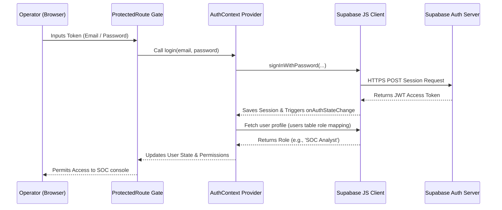

# ThreatStream Security Operations Platform Architecture

This document describes the design patterns, layer organization, and modular code architecture implemented in the ThreatStream Security Operations Center (SOC) platform.

---

## 1. Directory Structure Organization

The codebase is organized to support scalability, strong modular boundaries, and direct transition to live backend services:

```
threatstream/
├── .env.local                <-- Local secrets (Supabase credentials)
├── .env.example              <-- Template for deployment environments
├── DEPLOYMENT.md             <-- Guide on launching self-hosted containers
├── ARCHITECTURE.md           <-- [This File] Architectural specs
├── DATABASE.md               <-- Schema definition for all 36 database tables
├── MIGRATION_GUIDE.md        <-- Setup guide for Supabase / PostgreSQL schema
├── package.json
├── index.html
├── src/
│   ├── main.jsx              <-- App mount point
│   ├── App.jsx               <-- Handles router page registrations
│   ├── index.css             <-- Global design system CSS tokens
│   ├── config/
│   │   └── env.js            <-- Centralized fail-fast environment validation
│   ├── lib/
│   │   └── supabase/
│   │       └── client.js     <-- Reusable Supabase client wrapper
│   ├── types/
│   │   └── index.js          <-- Unified data schemas & JSDoc types catalog
│   ├── layouts/
│   │   └── DashboardLayout.jsx <-- Reusable page template frame
│   ├── components/           <-- Reusable component library (DataTable, MetricCard...)
│   ├── repositories/         <-- Repository Layer: Directly queries Supabase/fallback
│   │   ├── ThreatRepository.js
│   │   ├── AssetRepository.js
│   │   ├── TelemetryRepository.js
│   │   ├── IncidentRepository.js
│   │   ├── UserRepository.js
│   │   └── ConfigurationRepository.js
│   ├── services/             <-- Service Layer: Coordinates repositories & business stubs
│   │   ├── ThreatService.js
│   │   ├── AssetService.js
│   │   ├── TelemetryService.js
│   │   ├── IncidentService.js
│   │   ├── UserService.js
│   │   └── ConfigurationService.js
│   └── pages/                <-- UI Views: Communicates only with Services
│       ├── Dashboard.jsx
│       ├── ThreatIntelligence.jsx
│       ├── Assets.jsx
│       └── ...
└── supabase/
    └── migrations/           <-- PostgreSQL schema init files
        └── 20260705000000_init_soc_schema.sql
```

---

## 2. Decoupled Multi-Tier Design Pattern

To prevent duplicate code and ensure a clean path to full database integration, we follow a strict **Three-Tier Architecture**:

```
[  UI Page Views  ]
        │   (Communicates exclusively with Services via async requests)
        ▼
[  Service Layer  ]   <-- e.g. ThreatService.js, AssetService.js
        │   (Manages business logic, coordinates scanners, logs reports)
        ▼
[ Repository Layer ]  <-- e.g. ThreatRepository.js, AssetRepository.js
        │   (Direct database access wrappers, maps rows to types, mock fallback)
        ▼
[ Supabase Client ]   <-- lib/supabase/client.js
        │   (Pre-configured with fail-fast env variables)
        ▼
[ PostgreSQL DB  ]
```

### A. Centralized Type/Model Catalog
All records retrieved from repositories are mapped to models defined in `src/types/index.js` (such as `Threat`, `IOC`, `Asset`, `Incident`, etc.). This enforces structural schema validation across the client bundle.

### B. Fail-Fast Environment Validation
The configuration file `src/config/env.js` executes immediately on app load. If the required keys (`VITE_SUPABASE_URL` and `VITE_SUPABASE_PUBLISHABLE_KEY`) are missing, it throws a critical runtime error, preventing half-configured setups from starting.

### C. Graceful Mock Adapter Fallback
Each repository contains a local query wrapper. If the Supabase client encounters a missing table or fails to connect, it falls back to the in-memory mock datasets. This preserves frontend functionality out-of-the-box for demonstration and offline development.

---

## 3. Future Extension Strategy

1. **Integrating Live DB Data**:
   - Enable the schema tables inside Supabase (using `MIGRATION_GUIDE.md`).
   - Populate the database.
   - Set `VITE_USE_MOCK=false` inside the local `.env.local`.
2. **Plugging in Scanning Integrations**:
   - Add scan runners inside `src/services/AssetService.js` (e.g. mapping `executeScan` to a remote FastAPI endpoint running Nmap).
3. **Plugging in Threat Feeds**:
   - Add new feed collectors in the backend which write raw values directly to the `iocs` and `threat_events` tables in PostgreSQL.

---

## 4. Authentication Flow

The authentication architecture is built on Supabase Auth (JWT tokens) and loaded via React context provider:



---

## 5. RBAC Permission Model

Granular access controls are enforced on all module views using route permissions mapping:

| Role | Mapped Permissions | Protected Views |
| :--- | :--- | :--- |
| **Administrator** | All read/write controls, user profiles, configuration thresholds | `/administration`, `/dashboard`, `/assets`, `/incidents` |
| **SOC Analyst** | Read intel/assets/telemetry/incidents, write YARA/Sigma rules | `/dashboard`, `/threat-intelligence`, `/assets`, `/endpoints` |
| **Incident Responder** | Read logs, write and mitigate incidents, close tickets | `/dashboard`, `/incidents`, `/malware-analysis` |
| **Threat Hunter** | Read logs, scan assets directory, write rules | `/dashboard`, `/assets`, `/threat-hunting` |
| **Read Only** | Read-only access to threat maps, directories, and telemetries | `/dashboard`, `/threat-intelligence`, `/assets` |

---

## 6. Realtime Subscription Architecture

Real-time notifications and Attack Globe arcs synchronization are powered by PostgreSQL Write-Ahead Log (WAL) replication streams routed via Supabase Realtime pub/sub socket channels:

```
[ PostgreSQL Database Mutation ] (e.g. INSERT threat_events)
               │
               ▼
[ Write-Ahead Log (WAL) ]
               │ (Supabase Realtime listens to replication logs)
               ▼
[ Supabase Realtime Engine ]
               │ (Filters updates according to channel scope)
               ▼
[ WebSockets Stream Room ]
               │
               ▼
[ ThreatRepository client listener ]
               │ (Executes callbacks on child insertion)
               ▼
[ ThreatService & React Globe State ] (Attack arc render animation)
```

