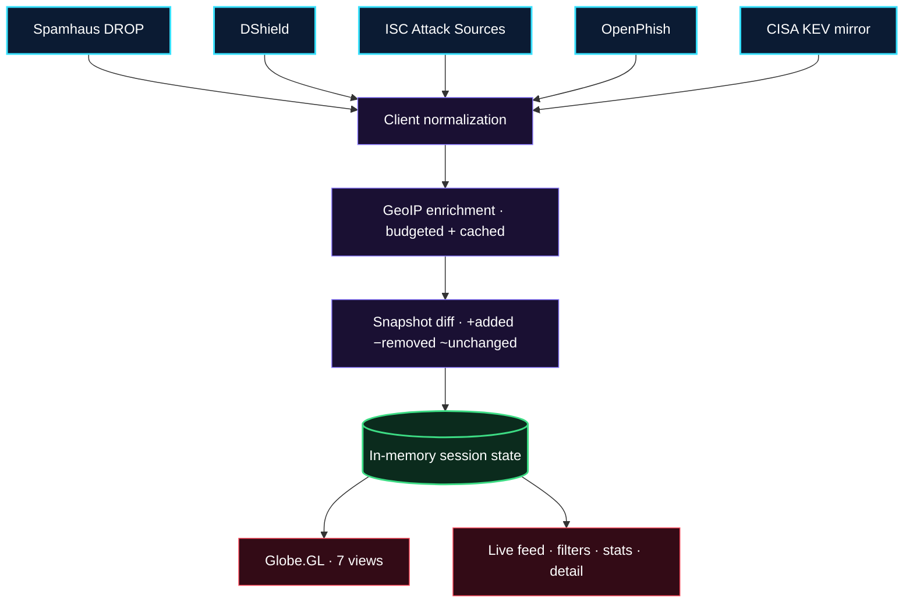
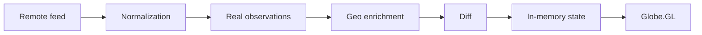

# 🛰 T H R E A T S T R E A M 🛰

### *Live cyber threat intelligence, visualized.*

[](https://git.io/typing-svg)

[](https://github.com/aadithya-vimal/threatstream)
[](https://react.dev/)
[](https://vite.dev/)
[](https://github.com/vasturiano/globe.gl)
[](#-deployment)
[](LICENSE)

```
                  · ✦ ·
          ·                    ·
                ╭──────────╮
      ·       ╭─   EARTH    ─╮        ·
             │  ●       ╲    │
       ·     │     ●─────╲ ● │    ·
              ╰──────────────╯
                   ·    ·
          ·                    ·
```

**A frontend-only cyber threat-intelligence monitor that turns live public security feeds into an interactive geographic operations view.**
*Real observations in. Attributed intelligence out. Nothing fabricated, ever.*

[Features](#-key-features) • [Quick Start](#-quick-start) • [Architecture](#-architecture--live-pipeline) • [Sources](#-live-data-sources) • [Globe](#-globe-visualization) • [Methodology](#-methodology--transparency) • [Deployment](#-deployment)

---

> Note
>
> **ThreatStream** does not invent attacks. Every marker, count, and timestamp on screen traces back to a real provider record fetched live in your browser — distinguish **observed facts** from **enriched context**, always with source attribution.

---

## ✦ Live Pipeline



---

## ⚡ Key Features

- **🌍 Globe.GL Operations Globe** — 7 switchable views (Operations, Threat Heatmap, Verified Flows, Threat Rings, Hex Density, Satellite, Minimal) over **one** real dataset. Genuine both-endpoint records render arcs with a continuously repeating directional pulse; source-only intel renders markers (red observed, amber enriched).
- **📡 Real Live Ingest** — five public providers polled on cadence (DROP/DShield 10 min, ISC/OpenPhish 30 min, KEV 60 min) with per-second countdowns, overlap-guarded scheduler, and honest `NO FEED CHANGES` quiet states.
- **🔄 Diff-Driven Transitions** — arrivals fade/scale in with rings, removals fade out through a grace window, changes pulse, `NEW` badges in-feed. Unchanged markers stay perfectly still. No replay, no simulation.
- **🧬 ASN Analytics** — real ASN/org attribution from GeoIP enrichment, clickable distribution that filters globe + feed + stats, with honest empty states.
- **🔍 Event Inspection** — overview, source, destination, evidence, enrichment, assessment, and attribution per record — including phishing URLs, CVE detail, and observed attack counts.
- **🌓 Dark/Light Analyst Themes** — runtime-only theming (follows system preference) with a permanent dark orbital globe viewport in both modes.
- **🛡 Honesty Architecture** — unknown stays `null`/`unknown`; destinations stay `null` unless genuinely supplied; zero confirmed paths reported instead of drawn.

---

## 🚀 Quick Start

### Prerequisites

- Node.js 18+ and npm

### Run locally

```powershell
git clone https://github.com/aadithya-vimal/threatstream.git
cd threatstream
npm install
npm run dev      # Vite on http://localhost:5173
```

### Verify

```powershell
npm test         # vitest: normalization, dedup, filtering, stats,
                 #        malformed input, missing coords, provider failure
                 #        isolation, timestamp + confidence handling,
                 #        purity (no randomness in the pipeline)
npm run build    # static output in dist/
npm run preview  # serve dist/ locally to verify
```

---

## 🌐 Live Data Sources

| Provider | What it publishes | Poll | What ThreatStream renders | Attribution |
|---|---|---|---|---|
| **Spamhaus DROP** via FireHOL mirror | CIDR ranges under hijacked / botnet-C&C control | 10 min | Source-only markers (●), geolocated in-browser | `https://www.spamhaus.org/drop/drop.txt` |
| **DShield** (SANS) via FireHOL mirror | Top ~20 attacking /24s seen over 3 days | 10 min | Source-only markers (●), geolocated in-browser | `https://www.dshield.org/block.html` |
| **ISC Attack Sources** (SANS, direct API) | Attacker IPs + observed counts + first/last seen | 30 min | Source-only markers (●), geolocated in-browser | `https://isc.sans.edu/` |
| **OpenPhish** Community Feed (raw GitHub mirror) | Reported phishing URLs (~300) | 30 min | Intel records (feed/stats only, never globe) | `https://www.openphish.com/phishing_feeds.html` |
| **CISA KEV** via official `cisagov/kev-data` mirror | CVEs confirmed exploited (~1700) | 60 min | Intel records (feed/stats only, never globe) | `https://www.cisa.gov/known-exploited-vulnerabilities-catalog` |
| **ipwho.is → ipwhois.app** (free, keyless) | Approximate IP → country/city/ASN/org | on demand | Enrichment only, labeled `geolocation_approximate` | Per-event, in detail panel |

**Unavailable:** Feodo Tracker (CORS-blocked + stale + Auth-Key). **Disabled:** URLhaus, ThreatFox, AbuseIPDB, GreyNoise, AlienVault OTX (secret keys — none ship in the bundle, ever).

---

## 🧭 Data Integrity



1. On load — and per source on its own cadence after (60-second scheduler, overlap-guarded, hidden-tab aware) — the provider registry fetches each enabled source directly from the browser.
2. Payloads normalize into `ThreatEvent`s (`src/lib/threat/model.js`).
3. Stable provider-derived ids power per-cycle diffs (`+added −removed ~unchanged`); unchanged data merges silently, removals fade out through a grace window, and the UI never pretends old data is new.
4. Missing coordinates resolve via budgeted, cached, TTL-retried GeoIP; failures stay `null` (“pending”), never guessed.
5. One provider failing degrades gracefully (others continue); all failing shows an honest empty state. **No mock fallback.**

### Observed vs Inferred

- **Observed** — stated directly by the provider (blocklist membership, counts, dates).
- **Enriched** — approximate IP metadata resolved in-browser.
- **Inferred** — only the `geolocation_approximate` marker. No victim guessing, no attack-path fabrication, no severity invention.

---

## 🌍 Globe Visualization

- **Operations** — real source markers with enter/fade/pulse lifecycle.
- **Threat Heatmap / Hex Density** — same records at constant weight 1; bin counts from data. Labeled *observation density*, never attack intensity.
- **Verified Flows** — arcs render **only** for records with both real endpoints; the pulse repeats continuously while loaded. Current feeds are source-only, so the UI reports **0 verified paths** instead of drawing arcs.
- **Threat Rings** — in-session arrivals only (≤3 min window).
- **Satellite / Minimal** — alternate textures and a performance-friendly fallback.

> Caution
>
> No keyless, browser-compatible, currently-updated victim-endpoint feed was found (ISC: sources + counts only · Feodo/URLhaus: CORS-blocked · ThreatFox: key-gated · ET/blocklist.de: bare IP lists, no CORS). Pairing unpaired endpoints would itself be fabrication — so arcs wait for real data.

---

## 📊 Methodology & Transparency

The in-app `/methodology` page documents sources, observed-vs-enriched semantics, GeoIP limits, timestamp kinds, dedup, refresh model, and limitations. Every claim on the globe traces back to evidence.

---

## 📦 Deployment

Deploy `dist/` as a static site (Cloudflare Pages, Vercel, Netlify, GH Pages).
No environment variables, no server, no secrets required.

```powershell
npm run build    # static output in dist/
```

---

## 🗂 Project Layout

```text
src/
  App.jsx  main.jsx  styles.css
  components/  globe/ (ThreatGlobe·LandingGlobe·views·starfield)  feed/  detail/
               filters/  stats/  ops/ (LiveIngest)  layout/  ui/
  features/  landing/  monitor/  events/  methodology/
  lib/  threat/ (model·normalize·dedup·filter·statistics)
        providers/ (spamhausDrop·dshield·iscSources·openphish·cisaKev·disabled·geoEnrichment·index)
        geo/ (coordinates)  format.js
  state/  ThreatIntelContext.jsx  ThemeContext.jsx   (in-memory session store)
```

---

## 📜 License

**ThreatStream — live cyber threat intelligence, visualized. Observed facts ≠ inferred context.**
